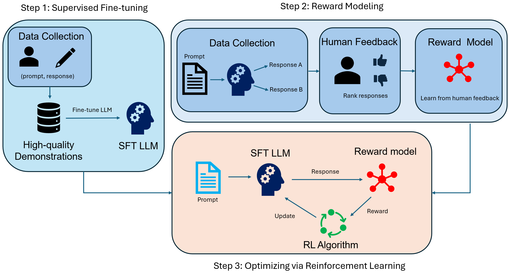

# RLHF Demo with TRL

### Minimal End-to-End Reinforcement Learning from Human Feedback Pipeline

This repository provides a minimal end-to-end RLHF pipeline using the Hugging Face `trl` library.

The implementation is intentionally small and fast so the full RLHF workflow can run locally for experimentation and educational purposes.

This demo can be trained using either CPU or GPU by setting `use_cpu=False` for GPU and `use_cpu=True` for CPU.

## Dataset: PRISM Alignment

This demo uses the dataset [`HannahRoseKirk/prism-alignment`](https://huggingface.co/datasets/HannahRoseKirk/prism-alignment).

PRISM is a diverse human feedback dataset for preference and value alignment in Large Language Models.


Both demos train on only tiny subsets of the dataset so the pipeline stays lightweight for a demo.

## RLHF Flow Chart



## Run RLHF Training Pipeline

```bash
python ppo_demo.py
```

## Run DPO

```bash
python dpo_demo.py
```

Adjust the sample-count constants in [dpo_demo.py](./dpo_demo.py) and [ppo_demo.py](./ppo_demo.py) if you want an even smaller or slightly larger demo run.

## Reference

```bibtex
@article{rlhf_revieww,
  title  = {Reinforcement Learning from Human Feedback: A Statistical Perspective},
  author = {Liu, Pangpang and Shi, Chengchun and Sun, Will Wei Sun}
}
```
